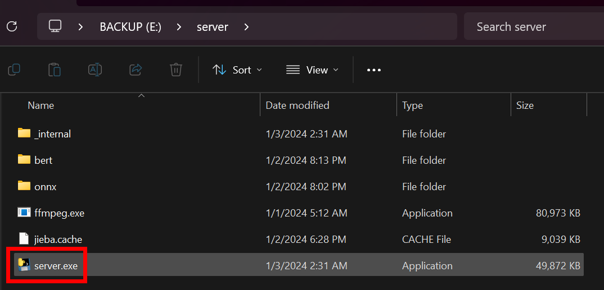
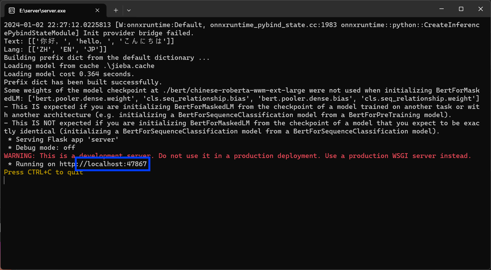
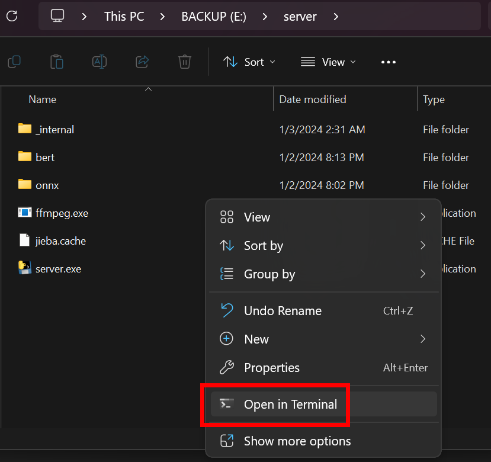
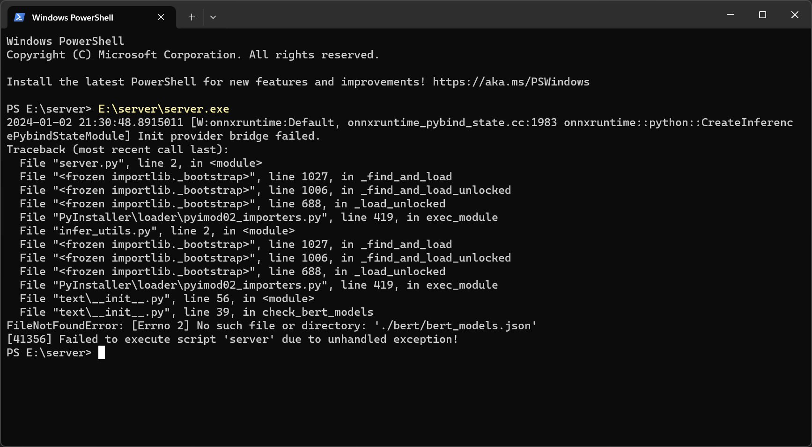

# Bert-VITS 2.3 ONNX RESTful 推理服务器

**NOTE: English doc is not available yet.**

本服务器旨在为http的tts请求提供响应。这可作为下游工具的基石，例如桌面OCR，自动礼物姬等。

## 如何使用（已编译版本）

为了降低使用门槛，您可以将整合包解压至任意目录，并且双击`server.exe`来启动服务器。



这可能需要十几秒到几分钟不等，取决于您的CPU性能、内存大小和频率、以及外存读写速度。

如果成功，您应该看到一行` * Running on http://localhost:47867`：



要关闭服务器，您可使用`Ctrl + C`组合键，或是使用右上角关闭。

### 如果报错了/黑窗口一闪而过

您需要了解为什么报错，并询问开发者（由于工期极短，没有用户友好的排错提示）。为此，您需要在解压目的地的根目录下右键或shift右键调出菜单，并点击其中的`Open in Terminal`：



您将可以看到以`Traceback (most recent call last):`为开头的调用栈信息，这将帮助开发者排查错误。例如：



在这张图中，主程序`server.exe`试图读取必要的`bert_models.json`，但同文件夹下没有`bert`目录:

```
$ tree --charset ascii
.
|-- onnx
|   `-- BertVITS2.3PT
|-- server.exe
|-- jieba.cache
`-- _internal
```

## 如何使用（使用源码运行）

请确保您安装了必要的依赖。之后，运行:

```
python server.py
```

您可通过修改源码的方式调整TTS合成参数，返回响度，使用的端口等。

## 编译为exe

我们仅在Windows 11 Pro下进行过编译测试，并且暂时不打算为其他平台编译。

### 创建虚拟环境

若您不想更改`server.spec`，那么您必须使用虚拟环境，并且环境名也必须保持一致。在根目录下执行：

```powershell
python -m venv .venv_windows
.\venv_windows\Scripts\Activate.ps1
```

### 安装依赖

```powershell
pip install -r requirements.txt
```

### 编译

在出厂设置的5950X上大约需要140秒完成编译。

```powershell
pyinstaller .\server.spec
```
